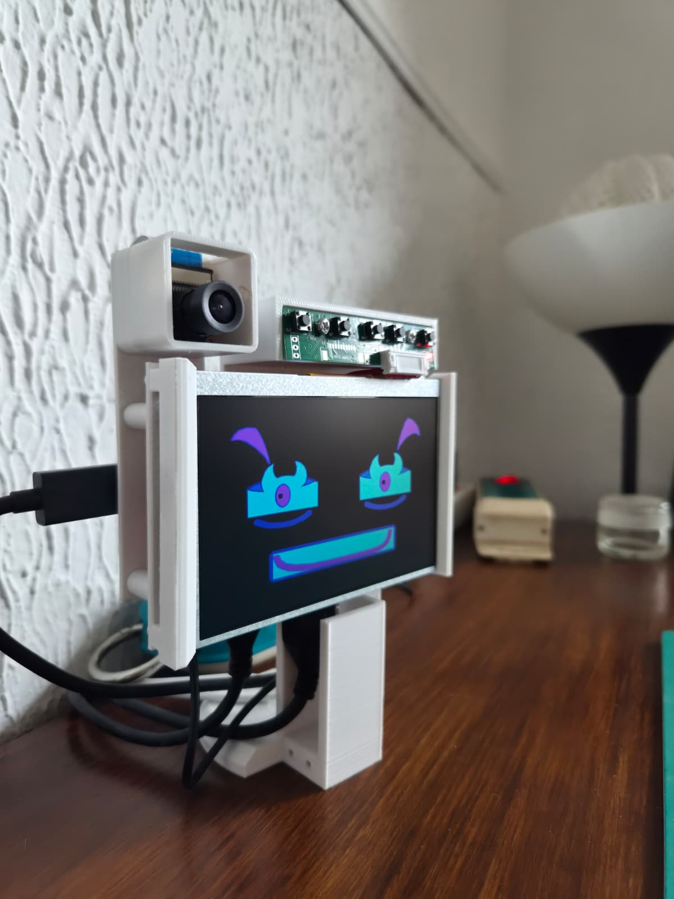

<p align="center">
  
</p>

<h1 align="center">Volp-E</h1>

<p align="center">
  <strong>Un petit compagnon robotique expressif, curieux et évolutif.</strong><br>
  Raspberry Pi • Vision • Coral Edge TPU • Visage animé • Voix • Desktop Brain
</p>

---

## À propos

**Volp-E** (prononcé *Volpi*) est un projet de robot compagnon construit autour d'une Raspberry Pi, d'un écran 5 pouces, d'une caméra et d'un cerveau externe optionnel sur PC.

L'objectif est de lui donner progressivement une présence crédible : regarder les personnes autour de lui, réagir à leur proximité, exprimer différents états, parler, mémoriser des événements récents et, à terme, interagir physiquement avec son environnement.

Le projet est encore en développement et évolue au fil des prototypes.

## État actuel

La version actuelle sait notamment :

* afficher un visage expressif sur l'écran 5 pouces ;
* détecter et suivre une présence via la caméra ;
* utiliser Coral / PyCoral pour la vision ;
* adapter son état selon la proximité et la présence d'une personne ;
* maintenir une mémoire courte en RAM ;
* gérer plusieurs humeurs internes (`calm`, `curious`, `attentive`, `searching`, `sleepy`, `happy`, `dreaming`) ;
* envoyer son état et des images vers un **Desktop Brain** sur PC ;
* sélectionner des phrases selon le contexte dans `desktop-brain/phrases.json` ;
* produire une voix via Piper sur le PC, avec `espeak-ng` comme solution de secours sur la Raspberry Pi ;
* passer automatiquement en veille après une période sans présence.

## Architecture

```text
                         ┌─────────────────────────┐
                         │       Desktop PC        │
                         │                         │
                         │  volpe_desktop_brain.py │
                         │  phrases.json           │
                         │  Piper / TTS             │
                         │  HTTP :8787              │
                         └───────────▲─────────────┘
                                     │
                           réseau local / HTTP
                                     │
                                     ▼
┌────────────────────────────────────────────────────┐
│                  Raspberry Pi                     │
│                                                   │
│  volpe-brain :8765                                │
│  vision + Coral                                   │
│  mémoire courte                                   │
│  visage / framebuffer                             │
│  synthèse vocale locale de secours                │
└───────────────┬────────────────────────────────────┘
                │
                ▼
        Écran • Caméra • Audio
```

## Structure du dépôt

```text
Volp-E/
├── assets/
│   └── images/
│       ├── volpe-hero.jpg
│       └── progress/
├── bin/
├── brain/
├── config/
├── desktop-brain/
├── face/
├── hardware/
├── models/
├── systemd/
├── tools/
├── vision/
├── install.sh
├── update.sh
└── README.md
```

## Installation sur la Raspberry Pi

Après avoir copié le projet sur la Pi :

```bash
cd ~/volp-e-pi
sudo ./install.sh
sudo reboot
```

Pour une mise à jour lorsque les dépendances système sont déjà installées :

```bash
cd ~/volp-e-pi
sudo ./update.sh
```

### Services principaux

```bash
sudo systemctl status volpe-brain.service --no-pager
sudo systemctl status volpe-vision.service --no-pager
sudo systemctl status volpe-face-fb.service --no-pager
```

## API locale de la Pi

Le cerveau local écoute sur :

```text
http://127.0.0.1:8765
```

Quelques commandes utiles :

```bash
curl 'http://127.0.0.1:8765/api/mode?mode=normal'
curl 'http://127.0.0.1:8765/api/mode?mode=sleepy'
curl 'http://127.0.0.1:8765/api/mode?mode=alert'
curl 'http://127.0.0.1:8765/api/mode?mode=standby'
curl 'http://127.0.0.1:8765/api/state'
```

## Desktop Brain

Le cerveau PC se trouve dans :

```text
desktop-brain/
```

Depuis Windows PowerShell :

```powershell
cd desktop-brain
.\start-desktop-brain.ps1
```

Il écoute sur :

```text
http://0.0.0.0:8787
```

Sur la Pi, renseigner l'adresse du PC dans :

```text
/etc/default/volp-e
```

Exemple :

```bash
VOLPE_EXTERNAL_BRAIN_URL=http://IP_DU_PC:8787
```

Puis :

```bash
sudo systemctl restart volpe-brain.service
curl 'http://127.0.0.1:8765/api/external/check'
```

## Banque de phrases

Les phrases du Desktop Brain sont stockées dans :

```text
desktop-brain/phrases.json
```

Elles sont classées selon le contexte :

* personne très proche ;
* personne à distance normale ;
* personne éloignée ;
* aucune présence ;
* retour d'une présence ;
* présence continue ;
* perte d'une présence ;
* humeur joyeuse ;
* humeur fatiguée ;
* humeur curieuse.

Cette banque est volontairement personnelle : elle sert à construire progressivement la personnalité propre de Volp-E.

## Personnalité

La personnalité générale est configurée dans :

```text
config/personality.json
```

Elle pilote notamment :

* le nom et la prononciation ;
* la chaleur et la curiosité ;
* le niveau de bavardage ;
* la vitesse d'évolution de l'énergie, de la curiosité et de la familiarité ;
* certains seuils d'attention liés à la caméra.

## Voix

Le Desktop Brain tente d'abord d'utiliser **Piper** pour produire la voix.

Si le serveur PC n'est pas disponible, la Raspberry Pi peut utiliser **espeak-ng** comme solution de secours.

Test manuel :

```bash
curl 'http://127.0.0.1:8765/api/say?text=Bonjour%20je%20suis%20Volp-E'
```

## Matériel 3D

Les éléments mécaniques destinés au projet peuvent être conservés dans :

```text
hardware/3d/
```

Les STL peuvent ainsi évoluer avec le logiciel tout en restant séparés du code.

## Journal visuel du projet

Les photos d'avancement sont conservées dans :

```text
assets/images/progress/
```

Exemple de convention de nommage :

```text
2026-08-16-volpe-desktop-brain.jpg
2026-08-20-camera-mount-v2.jpg
2026-09-02-head-pan-tilt.jpg
```

## Roadmap

Prochaines pistes de développement :

* enrichir la personnalité et la banque de phrases ;
* améliorer l'analyse d'image côté PC ;
* poursuivre le suivi pan/tilt de la tête ;
* intégrer les mouvements du bras robotique ;
* ajouter progressivement locomotion et interactions physiques ;
* faire évoluer la mémoire et les comportements autonomes ;
* documenter les versions mécaniques et électroniques.

## Galerie

### Prototype actuel — août 2026

<p align="center">
  
</p>

---

<p align="center">
  <strong>Volp-E est un projet expérimental en développement continu.</strong>
</p>
