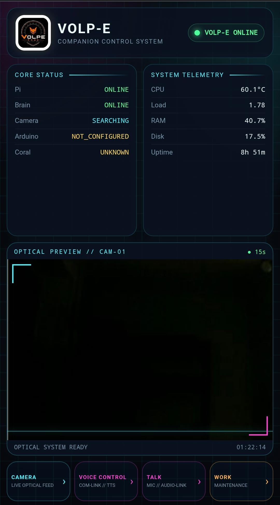
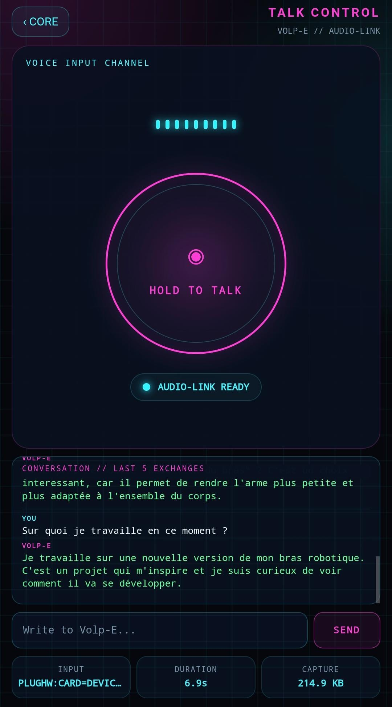

# Journal de bord — Volp-E

Ce fichier conserve les étapes importantes de l'évolution du projet.

## 16 août 2026 — Base matérielle, visage framebuffer et architecture

Cette première phase a posé les bases matérielles et logicielles de la version actuelle de Volp-E.

### Affichage, vision et comportement

* Passage du visage principal sur un rendu **framebuffer PNG**, sans Chromium, afin de gagner en stabilité sur Raspberry Pi 3A+.
* Ajout d'une bibliothèque d'expressions PNG pour les yeux, avec des assets précalculés pour un affichage rapide.
* Stabilisation de la vision avec caméra V4L2, Coral USB et suivi du regard.
* Ajout d'un cerveau externe optionnel sur PC capable d'analyser la scène et de renvoyer des intentions.
* Ajout des pensées affichées sous les yeux et du déclenchement automatique de phrases.
* Ajout d'une mémoire courte en RAM : présence, retour, proximité, perte de cible et état d'attention.
* Ajout d'une humeur active dérivée de l'énergie, de la curiosité, de la familiarité et de l'attention.
* Ajout d'une personnalité configurable dans `config/personality.json`.

### Audio

* Ajout d'une voix hybride : Piper côté PC lorsqu'il est disponible, avec secours local via `espeak-ng` sur la Raspberry Pi.
* Ajout d'une configuration audio permettant de forcer la sortie avec `VOLPE_APLAY_DEVICE`, par exemple `plughw:1,0`.

### Matériel

* Premier montage fonctionnel de la tête imprimée en PETG.
* Intégration de l'écran, de la Raspberry Pi, du Coral USB, de la caméra et du haut-parleur jack.
* Refroidissement identifié comme point à prévoir avant un usage prolongé.

## 16–17 août 2026 — Remise à plat et grosse évolution logicielle

Cette session marque une étape importante du projet : la version fonctionnelle réellement utilisée par Volp-E a été récupérée depuis la Raspberry Pi après qu'une copie locale du projet ait été altérée.

### Sauvegarde et GitHub

* Récupération de la version fonctionnelle présente dans `/opt/volp-e`.
* Sauvegarde des services `systemd` utilisés par Volp-E.
* Sauvegarde des paquets Python et système de la Raspberry Pi.
* Reconstruction d'un dépôt GitHub propre depuis la version fonctionnelle.
* Conservation des STL, de la documentation et de l'historique Git.
* Nettoyage des fichiers temporaires, backups et dépendances tierces inutiles dans le dépôt.

### Visage et vision

* Intégration du nouveau système de visage **Face V2**.
* Remplacement des anciens assets de visage par les nouveaux calques et PNG.
* Ajout du modèle `mobilenet\_ssd\_v2\_coco\_quant\_postprocess\_edgetpu.tflite`.
* Conservation du fonctionnement Coral / PyCoral côté Raspberry Pi.

### Personnalité

* Remplacement des phrases de démonstration générées par IA.
* Première banque `phrases.json` entièrement personnelle.
* Réorganisation de la sélection des phrases dans le Desktop Brain.
* La familiarité n'impose plus automatiquement `mood\_happy`.
* Mélange pondéré entre distance, continuité de présence, humeur et curiosité.
* Ajout d'une mémoire anti-répétition des dernières phrases utilisées.

### Voix

* Test d'une nouvelle voix Piper masculine.
* Adoption de **fr\_FR-tom-medium** comme voix du Desktop Brain.
* Conservation du fallback Windows TTS / `espeak-ng` si nécessaire.
* Validation du fonctionnement de Tom Medium avec le serveur `/speak`.

### Lancement Windows

* Ajout d'un lanceur `start-volpe-desktop-brain.cmd`.
* Le lanceur sélectionne automatiquement Tom Medium.
* Le Desktop Brain peut être démarré à la demande via un simple raccourci Bureau.
* Aucun démarrage automatique Windows n'est activé.

### État en fin de session

Volp-E est opérationnel avec :

* Raspberry Pi et services système fonctionnels ;
* Face V2 ;
* vision et suivi de présence ;
* Desktop Brain sur PC ;
* banque de phrases personnelle ;
* sélection de phrases plus variée ;
* anti-répétition ;
* voix masculine Tom Medium ;
* dépôt GitHub propre et documenté.

## 18 août 2026 — API de contrôle, application mobile et conversation locale

Cette session transforme Volp-E en système réellement pilotable depuis le téléphone et ajoute une chaîne complète de conversation locale, sans service d'IA payant.

### API de contrôle sur la Raspberry Pi

* Passage de l'API de contrôle sur une adresse réseau accessible depuis le LAN, tout en conservant les paramètres locaux dans `/etc/default/volp-e`.
* Ajout d'un endpoint `/api/status` pour exposer l'état de la Raspberry Pi, du Desktop Brain, de la caméra, de l'Arduino et du Coral.
* Ajout d'un endpoint `/api/system` pour remonter la température CPU, la charge système, l'utilisation de la RAM, l'espace disque et l'uptime.
* Conservation d'une architecture où la Raspberry Pi sert de **gateway centrale** entre l'application, le Desktop Brain et les futurs contrôleurs matériels.

### Application mobile / cockpit Cyberpunk

* Transformation de l'interface web en application ajoutable à l'écran d'accueil du téléphone.
* Ajout du manifest et des icônes Volp-E.
* Refonte graphique complète dans un style sombre et néon inspiré des interfaces cyberpunk.
* Compactage de la page principale pour tenir sur un écran de téléphone sans défilement.
* Organisation du cockpit avec :
  * en-tête Volp-E compact et statut online ;
  * **Core Status** et **System Telemetry** côte à côte ;
  * aperçu caméra ;
  * boutons **Camera**, **Voice Control** et **Talk**.
* Uniformisation progressive de l'interface en anglais.

### Caméra

* Ajout de `/api/camera/frame` pour récupérer une image JPEG instantanée.
* Ajout de `/api/camera/stream` pour exposer un flux MJPEG en direct.
* Réutilisation de l'image déjà produite par le système de vision afin de ne pas ouvrir une seconde fois `/dev/video0`.
* Ajout d'une page **Optical Feed** dédiée au flux live.
* Ajout d'un aperçu caméra sur la page d'accueil, actualisé automatiquement toutes les 15 secondes.
* Mise au point physique de la caméra réalisée directement depuis le téléphone grâce au flux live.

### Voice Control

* Ajout d'une page **Voice Control** permettant d'envoyer du texte à Volp-E.
* Connexion de cette interface à `/api/say`.
* Validation de la chaîne :
  * téléphone → API Raspberry Pi ;
  * Desktop Brain ;
  * Piper ;
  * retour audio vers la Raspberry Pi ;
  * lecture sur le haut-parleur de Volp-E.
* Ajout de commandes vocales rapides et d'un journal de transmissions.

### Talk Control et capture du microphone

* Ajout d'une page **Talk Control** avec bouton `HOLD TO TALK`.
* Le téléphone agit comme télécommande tandis que l'enregistrement utilise le microphone physique de Volp-E.
* Ajout des endpoints :
  * `/api/talk/start` ;
  * `/api/talk/stop` ;
  * `/api/talk/status`.
* Détection et configuration du microphone USB sur `plughw:2,0`.
* Enregistrement des prises de parole dans `/tmp/volpe-talk.wav`.
* Validation de la capture et de la lecture audio depuis la Raspberry Pi.

### Speech-to-Text

* Installation de **Faster-Whisper** sur le Desktop Brain.
* Ajout d'un endpoint `/transcribe` sur le PC.
* Ajout de `/api/talk/process` sur la Raspberry Pi pour envoyer automatiquement l'enregistrement au Desktop Brain.
* Affichage de la transcription directement dans l'interface Talk.
* Ajout d'un prétraitement audio avec FFmpeg avant transcription :
  * filtre passe-haut ;
  * filtre passe-bas ;
  * réduction légère du bruit ;
  * normalisation dynamique.
* Le prétraitement améliore nettement l'exploitation du microphone sans augmenter davantage son gain matériel.

### Cerveau conversationnel local

* Installation d'**Ollama** sur le PC.
* Adoption de **Qwen3 1.7B** comme premier modèle conversationnel local léger.
* Ajout d'un endpoint `/chat` au Desktop Brain.
* Ajout d'une personnalité système spécifique à Volp-E : réponses en français, courtes, naturelles, curieuses et adaptées à un robot compagnon.
* Ajout d'une petite mémoire de conversation côté Desktop Brain.
* Ajout de `/api/talk/think` sur la Raspberry Pi.
* Validation de la chaîne complète :

`Microphone → FFmpeg → Faster-Whisper → Qwen3/Ollama → Piper → haut-parleur`

* L'interface Talk affiche désormais les états **PROCESSING → THINKING → RESPONDING** ainsi que la transcription et la réponse générée.
* Volp-E peut maintenant recevoir une phrase orale, la comprendre, générer une réponse localement et la prononcer.

### Gestion des paroles automatiques

* Réduction drastique de la fréquence des paroles spontanées.
* Passage de `min_interval_seconds` à **180 secondes**.
* Passage de `think_cooldown_seconds` à **120 secondes**.
* Ajout d'une priorité de conversation empêchant les phrases automatiques d'interrompre une interaction Talk.
* Les états `listening`, `processing`, `thinking` et `responding` verrouillent le canal vocal.
* Après une réponse manuelle, les paroles automatiques restent bloquées pendant environ **20 secondes**.

### État en fin de session

Volp-E dispose maintenant de :

* un cockpit mobile plein écran ;
* télémétrie système en direct ;
* aperçu caméra et flux live ;
* contrôle vocal par texte ;
* capture du microphone physique ;
* transcription locale ;
* modèle conversationnel local gratuit ;
* synthèse vocale Piper ;
* priorité correcte entre conversation et comportements autonomes ;
* une chaîne conversationnelle entièrement locale, sans coût par requête.

## 19 août 2026 — Contexte robot, chat texte, maintenance et mémoire persistante

Cette session marque une nouvelle étape importante : Volp-E devient plus cohérent dans ses interactions, gagne une interface de maintenance dédiée et commence à conserver des souvenirs au-delà des redémarrages du Desktop Brain.

### Contexte physique et réponses fiables

* Ajout d'un endpoint `/api/context` sur la Raspberry Pi pour exposer un contexte robot structuré au Desktop Brain.
* Le contexte comprend notamment :
  * mode courant ;
  * état caméra ;
  * présence détectée ou non ;
  * distance et position de la personne ;
  * taille du visage ;
  * temps écoulé depuis la dernière détection ;
  * humeur, énergie, curiosité, familiarité et attention ;
  * résumé mémoire et dernier événement ;
  * état voix, conversation et Desktop Brain ;
  * uptime.
* Transmission du `robot_context` au Desktop Brain lors des échanges Talk.
* Correction de l'ordre des messages envoyés à Qwen afin que l'état physique actuel soit plus récent et prioritaire sur l'historique conversationnel.
* Renforcement du prompt pour empêcher le modèle d'inventer ou de contredire les capteurs.
* Mise en évidence d'une limite du petit modèle Qwen3 1.7B : il pouvait encore répondre l'inverse d'un fait capteur pourtant correct.
* Ajout d'un mécanisme de **réponses déterministes pour les questions capteur simples**.
* Les questions comme « Tu me vois ? » ou « Tu détectes quelqu'un ? » sont maintenant résolues directement depuis l'état réel du robot, sans laisser Qwen arbitrer le fait.
* Validation du comportement :
  * personne présente → réponse affirmative ;
  * personne absente → réponse négative.
* Séparation claire entre faits physiques déterministes et conversation libre générée par le modèle.

### Chat texte dans Talk Control

* Ajout d'un endpoint `/api/chat/text` sur la Raspberry Pi.
* Le chat texte utilise la même chaîne conversationnelle que Talk :
  * contexte robot ;
  * règles de capteurs ;
  * historique Qwen ;
  * personnalité ;
  * synthèse vocale.
* Ajout d'un champ texte et d'un bouton **SEND** dans la page Talk.
* Les messages écrits sont transmis au Desktop Brain puis prononcés par Piper comme les réponses vocales.
* Voix et texte partagent désormais la même conversation logique.
* Transformation de la zone `TRANSCRIPTION / RESPONSE` en mini historique.
* Conservation des **5 derniers échanges** dans `localStorage` côté navigateur.
* Les échanges vocaux et écrits alimentent le même historique visuel.

### Personnalité conversationnelle

* Ajustement du prompt du Desktop Brain pour rendre Volp-E moins neutre et plus naturel.
* Ajout de règles permettant à Volp-E :
  * d'avoir de légères préférences personnelles ;
  * de choisir réellement entre plusieurs options ;
  * de rester cohérent avec ses avis précédents ;
  * d'éviter les réponses du type « je préfère rester neutre » lorsqu'aucune neutralité n'est nécessaire.
* Renforcement de la curiosité :
  * possibilité de poser de petites questions de suivi ;
  * questions simples, directement liées au sujet ;
  * fréquence volontairement modérée pour éviter un effet interrogatoire.
* Ajout de règles de conversation sociale :
  * réponses courtes aux salutations et départs ;
  * réactions naturelles aux phrases comme « je vais manger », « bonne nuit », « à toute » ;
  * limitation des analyses inutiles sur les échanges banals.
* Ajout d'exemples concrets au prompt afin d'aider Qwen3 1.7B à mieux suivre le style attendu.

### Page WORK / Maintenance

* Ajout d'une quatrième page **WORK // MAINTENANCE** dans l'application mobile.
* Ajout d'un quatrième bouton **WORK** sur la page principale, à côté de **Camera**, **Voice Control** et **Talk**.
* Ajout de trois actions système :
  * **Restart Brain** ;
  * **Reboot** ;
  * **Power Off**.
* Mise en place de confirmations avant les actions critiques.
* Ajout d'une règle `sudoers` limitée aux commandes nécessaires, sans donner un accès sudo libre à l'application.
* Ajout de diagnostics live affichant notamment :
  * état de la Pi ;
  * Desktop Brain ;
  * caméra ;
  * présence ;
  * température CPU ;
  * RAM ;
  * disque ;
  * humeur.
* Ajout d'un endpoint `/api/work/logs`.
* Ajout d'un **pseudo-terminal de logs** dans la page WORK.
* Les logs du service `volpe-brain` sont rafraîchis automatiquement environ toutes les 2 secondes.
* La page WORK devient le cockpit de maintenance et d'observation du robot.

### V0.6a — Mémoire persistante explicite

* Ajout d'un fichier local `desktop-brain/memory.json`.
* Ajout d'une mémoire longue durée séparée de `CHAT_HISTORY`.
* La mémoire persistante est :
  * chargée au démarrage ;
  * sauvegardée sur disque ;
  * injectée dans le contexte Qwen ;
  * plafonnée à 50 souvenirs.
* Ajout de commandes explicites de mémorisation :
  * « Souviens-toi que... » ;
  * « Retiens que... » ;
  * « Mémorise que... » ;
  * « N'oublie pas que... » ;
  * « Garde en mémoire que... ».
* Les commandes explicites sont interceptées de manière déterministe avant Qwen.
* Ajout d'un endpoint `/memory` sur le Desktop Brain pour inspecter les souvenirs persistants.
* Validation de la persistance après redémarrage complet du Desktop Brain.
* Exemple validé : conservation du jeu préféré de l'utilisateur au-delà d'un redémarrage.

### Séparation utilisateur / Volp-E dans la mémoire

* Correction d'un problème d'attribution des souvenirs où Qwen pouvait interpréter un « mon » utilisateur comme appartenant à Volp-E.
* Ajout de règles d'identité explicites dans le prompt :
  * Volp-E est distinct de l'utilisateur ;
  * un message `user` provient toujours de l'interlocuteur ;
  * `je`, `moi`, `mon`, `ma`, `mes` dans un message utilisateur désignent l'utilisateur ;
  * les souvenirs utilisateur ne doivent jamais être attribués à Volp-E.
* Ajout d'une migration des anciens souvenirs.
* Les souvenirs sont désormais préfixés explicitement :
  * `UTILISATEUR : ...`
  * `VOLP-E : ...`
  * `GÉNÉRAL : ...`
* Correction d'un bug d'ordre d'exécution Python dans la migration, puis validation du redémarrage.
* Validation du comportement :
  * « Qui est l'utilisateur ? » → Volp-E identifie correctement Renaud et peut citer un souvenir associé ;
  * les préférences de l'utilisateur ne sont plus automatiquement reprises comme préférences de Volp-E.

### V0.6b — Mémoire semi-automatique

* Ajout d'une mémoire semi-automatique en arrière-plan.
* Après une réponse normale, un second passage léger de Qwen peut décider si le message utilisateur contient une information durable utile.
* Le classifieur de mémoire est volontairement conservateur.
* Les catégories mémorisables comprennent notamment :
  * identité ;
  * préférence ;
  * projet ;
  * objectif ;
  * habitude ;
  * relation ;
  * fait important.
* Les éléments temporaires ou triviaux sont filtrés :
  * salutations ;
  * départs ;
  * humeur temporaire ;
  * actions ponctuelles ;
  * petites conversations.
* Ajout d'un seuil de confiance élevé avant écriture en mémoire.
* L'analyse mémoire tourne dans un thread séparé afin de ne pas ralentir la réponse principale.
* Les commandes explicites de V0.6a restent prioritaires et permettent toujours de forcer un souvenir.
* Validation de la chaîne :
  * conversation normale ;
  * analyse mémoire ;
  * écriture dans `memory.json` ;
  * redémarrage ;
  * souvenir retrouvé.

### Sauvegarde du soir et GitHub

* Mise en place d'un workflow de fin de session reproductible.
* Synchronisation des fichiers modifiés de la Raspberry Pi vers la copie fonctionnelle du PC.
* Conservation du Desktop Brain fonctionnel côté PC comme référence pour les composants Windows.
* Création d'un snapshot local daté complet du projet.
* Sauvegarde séparée de la configuration système privée de la Pi :
  * `/etc/default/volp-e` ;
  * service `volpe-brain.service` ;
  * règle sudoers `volpe-work`.
* Ces fichiers privés restent hors du dépôt GitHub public.
* Mise à jour du clone GitHub local avec les fichiers validés.
* Vérification des fichiers suivis avant commit.
* `memory.json` reste hors du dépôt afin de ne pas publier les souvenirs personnels de Volp-E.
* Commit et push validés sur `main`.
* Commit principal de la session :
  * `f37f66c` — `Add work console and persistent conversational memory`.
* État final du dépôt :
  * branche `main` synchronisée avec `origin/main` ;
  * working tree propre ;
  * sauvegarde locale et distante terminée.

### État en fin de session

Volp-E dispose maintenant de :

* réponses capteur fiables et déterministes ;
* contexte physique transmis au cerveau conversationnel ;
* chat texte intégré à Talk ;
* historique visuel des 5 derniers échanges ;
* personnalité plus curieuse, plus sociale et moins neutre ;
* page WORK dédiée à la maintenance ;
* redémarrage du cerveau, reboot et extinction depuis le téléphone ;
* diagnostics live ;
* pseudo-terminal de logs ;
* mémoire persistante explicite ;
* séparation claire entre souvenirs utilisateur et souvenirs de Volp-E ;
* mémoire semi-automatique en arrière-plan ;
* sauvegarde du soir structurée ;
* dépôt GitHub à jour après validation complète de la session.

### Captures de progression — 19 août 2026

Cockpit mobile principal après l'ajout de la télémétrie, du flux caméra et des quatre espaces **Camera / Voice Control / Talk / Work** :

Interface **Talk Control** avec conversation vocale, chat texte et historique des cinq derniers échanges :

